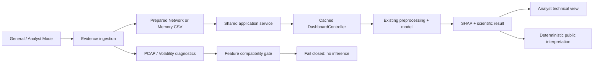

# BEACON

**Behavioral Explainable AI for Cyber Operations Network — v1.0.0**

BEACON is a local, explainable malware-classification platform for prepared
Network and Memory telemetry. It provides a simple General experience and a
technical Analyst experience over the same validated XGBoost, probability, and
SHAP pipelines.

## What BEACON does

- classifies prepared telemetry into nine categories: Backdoor, Benign,
  Exploit, HackTool, Hoax, Rootkit, Trojan, Virus, and Worm;
- combines Network flow probabilities into the existing capture-level verdict;
- provides class probabilities and feature-level SHAP evidence;
- translates completed results into deterministic public explanations without
  external generative AI; and
- parses selected raw-evidence formats diagnostically while failing closed
  before inference when feature equivalence is unproven.

BEACON reports model evidence. It does not prove infection or replace incident
response by a qualified professional.

## User modes

### General Mode

A guided **Home → Analyze → Results → About** workflow for non-technical users.
It prioritizes plain-language meaning, evidence-grounded reasons, precautionary
next steps, limitations, and an optional technical-details expander.

### Analyst Mode

A technical **Dashboard → Network Detection → Memory Detection →
Explainability → Methodology → About** workflow. It retains probabilities,
row-level output, feature values, SHAP, model context, exports, and compatibility
diagnostics.

Switching modes preserves the same result and does not rerun models.

## Supported inputs

### Production inference

| Input | Route |
|---|---|
| Prepared Network CSV | Existing Network controller → preprocessing → model → capture aggregation → SHAP |
| Prepared Memory CSV | Existing Memory controller → preprocessing → model → SHAP |

### Diagnostic only

| Input | Behavior |
|---|---|
| PCAP / PCAPNG | Parses packets and diagnostic flows; blocked by the unproven 342-feature Network contract |
| Structured Volatility JSON | Preserves records and reports 94-feature compatibility; blocked because extraction semantics are unproven |

Diagnostic formats **do not produce malware verdicts**. Raw memory, executables,
archives, and event-log ingestion are not supported.

Current input support remains prepared CSV telemetry only for production
inference. Diagnostic parsing does not expand the validated model inputs.

## Architecture



See [`docs/Final_Architecture.md`](docs/Final_Architecture.md).

The production route is: **Upload → Evidence ingestion → ParsedEvidence →
Application service → DashboardController → existing model and SHAP**.

## Network pipeline

The Network model expects its committed 342-feature contract. Identifier
columns are excluded by the validated pipeline. Existing per-flow probabilities
are averaged into one capture verdict. Recorded evaluation reports **99.1% per
capture** (n=447) and **68.2% per flow** (n=129,118); these units answer different questions and
must not be conflated.

Native capture extraction is not production-enabled because the original flow
extractor and a paired capture/prepared-CSV reference are unavailable.
Phase 3 does not enable native-capture model inference.

## Memory pipeline

The Memory model expects its committed ordered 94-feature contract. Recorded
evaluation is **59.2% accuracy** with macro F1 **0.558**. Family classification is less reliable than Network capture-level
classification, particularly for overlapping families.

Structured Volatility JSON is diagnostic only. Matching field names does not
prove equivalent plugin versions, filtering, aggregation, or sample semantics.

## Explainability and public interpretation

The existing SHAP `TreeExplainer` path supplies technical feature values and
contributions. The public interpretation layer deterministically translates the
actual category, numeric confidence, and strongest real SHAP items. Unknown
features receive conservative wording. No external LLM is called, no new score
is invented, and no arbitrary abstention threshold is activated.
No external generative AI is used. Public explanations do not alter prediction,
probability, aggregation, confidence, or SHAP.

## Installation

Python 3.11+ is recommended.

```bash
python -m venv .venv
. .venv/bin/activate
pip install -r requirements.txt
```

Dependencies are pinned in `requirements.txt`; committed model artifacts allow
inference and tests without the raw training dataset.

## Running the app

```bash
streamlit run app.py
```

Open the displayed local URL. For a safe presentation, follow
[`docs/Supervisor_Demo_Guide.md`](docs/Supervisor_Demo_Guide.md) using the
synthetic fixtures in `demo/`.

## Running tests

```bash
python -m pytest -q
python -m compileall -q app.py pages pipeline tests
git diff --check
```

The v1.0.0 release suite contains **202 tests** and requires no raw dataset.
Model-backed tests synthesize schema-valid inputs from committed contracts and
compare the application path with direct controller behavior.

## Project structure

```text
app.py                 Streamlit entry point and dual-mode navigation
pages/                 General and Analyst presentation pages
pipeline/              ingestion, application, validated core, contracts, interpretation, UI
models/                 committed classifiers, preprocessing artifacts, metrics
scripts/                training and research scripts (not run by the app)
tests/                  unit, parity, security, diagnostic, and UI tests
demo/                   deterministic synthetic presentation fixtures
docs/                   architecture, validation, baselines, limitations, demo guide
VERSION                 release version
```

## Limitations

- Native PCAP/PCAPNG and Volatility/raw-memory feature equivalence is unproven.
- Memory family classification is materially weaker than Network capture-level classification.
- Evaluation retains the original single-fold limitation; no confidence intervals are invented.
- Public interpretation explains model evidence and is not a compromise confirmation.
- Streamlit is a single-process interactive application; documented input limits reduce but do not eliminate resource-exhaustion risk.

See [`docs/Limitations_and_Future_Work.md`](docs/Limitations_and_Future_Work.md).

## Future work

Recover original feature extractors, acquire paired raw/prepared references,
validate across tool versions, perform cross-validation, and investigate richer
identity-bearing Memory and event-log features as separate retraining research.
These capabilities are not part of v1.0.0.

## Research and methodology

- [`docs/Project_Summary.md`](docs/Project_Summary.md)
- [`docs/Final_Validation_Matrix.md`](docs/Final_Validation_Matrix.md)
- [`docs/Chapter5_Software_Design_Specification.md`](docs/Chapter5_Software_Design_Specification.md)
- [`docs/Phase3_Feature_Reproduction.md`](docs/Phase3_Feature_Reproduction.md)
- [`docs/Phase6_Memory_Feature_Reproduction.md`](docs/Phase6_Memory_Feature_Reproduction.md)
- `models/network_metrics.json` and `models/memory_metrics.json`

The original exploratory notebooks and project report remain historical research
records; the application uses the tested `pipeline/` implementation.
