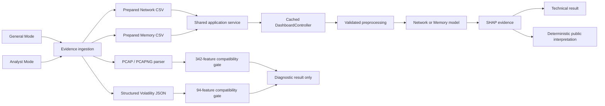

# BEACON v1.0.0 final architecture

## System diagram

## Responsibilities

- **User layer:** General Mode simplifies upload and interpretation; Analyst Mode exposes probabilities, per-row output, SHAP, methodology, and diagnostics.
- **Ingestion layer:** captures bytes and metadata, explicitly routes evidence, parses supported structures, and never predicts.
- **Application layer:** owns one cached controller per stream and the shared `AnalysisOutput`; session state preserves results between modes.
- **Scientific layer:** the existing controller owns validation, preprocessing, prediction, aggregation, confidence, and SHAP.
- **Interpretation layer:** deterministically translates the completed class, numeric confidence, and real SHAP evidence without altering inference.
- **Compatibility gates:** PCAP/PCAPNG and Volatility JSON remain diagnostic because exact training-feature semantics have not been empirically reproduced.

Production inference is CSV-only. Diagnostic parsing is not a malware verdict.
Raw memory and executable analysis are not implemented.
